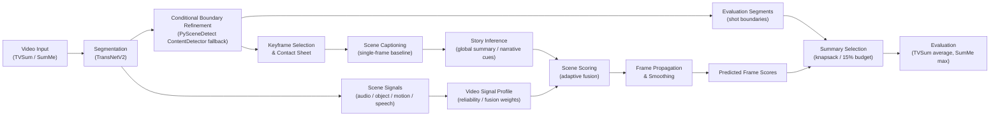
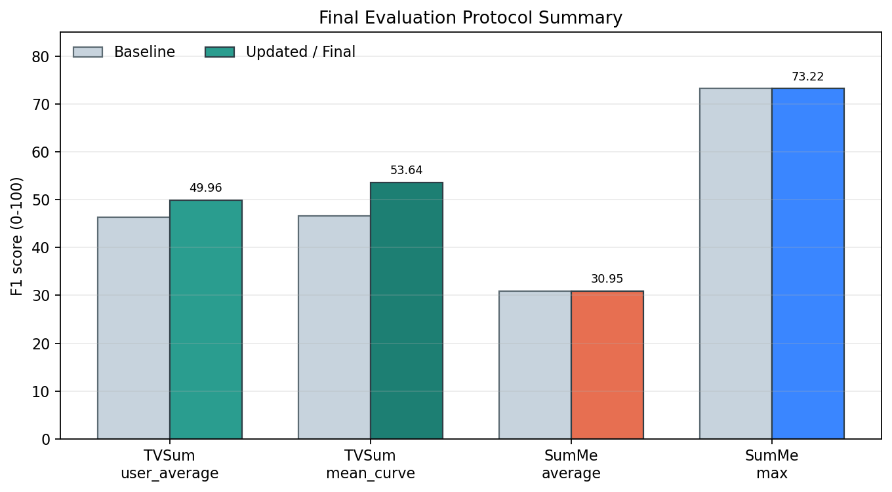
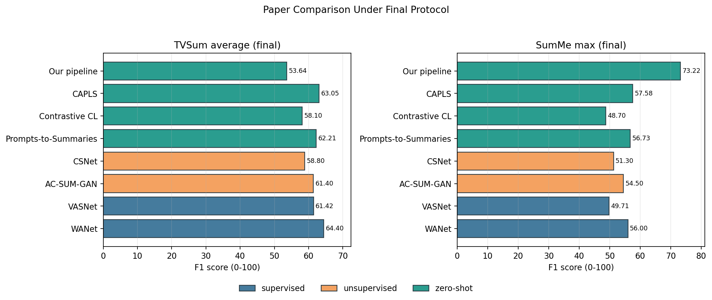

# 비디오 요약 최종 보고서 (Final Video Summarization Report)

## 1. 최종 평가 기준 (Final Evaluation Protocol)

이번 최종 보고서는 아래 기준으로 통일했습니다.

- `TVSum`: `average` 해석 중에서도 `mean_curve` 분기 사용
  - 평가자들의 프레임 중요도 점수(`importance score`)를 평균 내어 `평균 중요도 곡선 (mean importance curve)`을 만들고,
  - 그 곡선으로부터 정답 요약을 구성하는 방식에 더 가깝게 맞췄습니다.
- `SumMe`: `max` 사용
  - 모델 요약을 각 사용자 정답 요약과 비교한 뒤, 가장 높은 `F1 score`를 사용합니다.

즉 최종 수치는 다음 두 값입니다.

- `TVSum average = 53.64`
- `SumMe max = 73.22`

## 2. 전체 시스템 도식 (System Diagram)

### 2.1 단계별 핵심 설명 (Step-by-Step Core Explanation)

1. `Video Input`
- 입력은 `TVSum` 또는 `SumMe`의 원본 비디오입니다.
- 최종 목표는 각 프레임의 중요도(`frame importance`)를 예측하고, 그로부터 `15% summary budget`에 맞는 요약 구간을 선택하는 것입니다.

2. `Segmentation (TransNetV2)`
- 먼저 비디오를 shot 단위로 나눕니다.
- 이 단계가 너무 거칠면 여러 사건이 한 shot에 뭉쳐서 `summary selection`이 불안정해지고,
- 너무 잘게 쪼개지면 `over-segmentation` 때문에 점수가 흔들릴 수 있습니다.

3. `Conditional Boundary Refinement (PySceneDetect fallback)`
- `TVSum`의 일부 `low-shot` 영상에서는 기본 segmentation이 너무 거칠게 나오는 문제가 있었습니다.
- 그래서 조건을 만족하는 경우에만 `PySceneDetect ContentDetector fallback`으로 경계를 보강합니다.
- 다만 지금은 안전장치를 넣어서, shot 수가 과도하게 늘어나는 경우는 거절합니다.

4. `Keyframe Selection / Contact Sheet`
- 각 shot에서 대표 프레임(`keyframe`)을 고릅니다.
- 이 프레임들은 이후 captioning의 입력이 되고, 사람이 qualitative review를 할 때도 핵심 자료가 됩니다.

5. `Scene Captioning`
- keyframe을 바탕으로 shot의 장면 설명(`scene caption`)을 만듭니다.
- 이 설명은 story inference와 scene scoring에서 모두 사용되므로, shot의 핵심 내용이 과도하게 빠지지 않는 것이 중요합니다.

6. `Scene Signals (audio / object / motion / speech)`
- 장면 설명만으로 부족한 부분을 보완하기 위해 추가 신호(`signal`)를 뽑습니다.
- 여기에는
  - 오디오 변화(`audio novelty`)
  - 객체 변화(`object change`)
  - 움직임(`motion`)
  - 발화 존재(`speech presence`)
  가 포함됩니다.
- 중요한 원칙은 “단서를 많이 쓰는 것”이 아니라, 영상마다 **신뢰도 높은 단서만 선택적으로 쓰는 것**입니다.

7. `Story Inference`
- 전체 비디오를 한 편의 흐름으로 보고, 글로벌 줄거리(`global summary`)와 이야기 단서(`narrative cues`)를 만듭니다.
- 이 단계는 “이 shot이 영상 전체 맥락에서 왜 중요한가?”를 알려주는 역할을 합니다.

8. `Video Signal Profile`
- 영상마다 어떤 단서를 더 믿어야 할지 먼저 판단합니다.
- 예를 들어 어떤 영상은 `audio`가 더 믿을 만하고, 어떤 영상은 `object`나 `motion`이 더 중요할 수 있습니다.
- 이 결과가 `adaptive fusion weight`로 이어집니다.

9. `Scene Scoring (adaptive fusion)`
- `story`, `audio`, `object`, `motion`, `speech`를 고정 규칙이 아니라 가중합(`adaptive fusion`)으로 합쳐 shot 중요도를 계산합니다.
- 즉 모든 영상에 같은 scorer를 쓰는 것이 아니라, **영상 유형과 신호 신뢰도에 따라 다른 비중**을 주는 구조입니다.

10. `Frame Propagation / Smoothing`
- shot 단위 점수를 frame 단위 점수로 펼칩니다.
- 이때 경계 기반 smoothing을 적용해, frame score가 너무 들쭉날쭉하지 않게 만듭니다.

11. `Evaluation Segments`
- 최종 요약 평가는 frame score만으로 끝나지 않고, 어떤 segment를 선택하느냐에 크게 좌우됩니다.
- 그래서 segmentation 경계는 평가 단계에서도 직접 영향을 줍니다.

12. `Summary Selection (knapsack / 15% budget)`
- frame score와 segment 경계를 이용해, 전체 길이의 `15%` 안에서 가장 중요한 구간을 선택합니다.
- 실제 `F1 score`는 이 단계가 얼마나 정답 요약과 잘 맞느냐에 크게 의존합니다.

13. `Evaluation`
- `TVSum`은 최종적으로 `average` 해석을 사용하고, 이 보고서에서는 `mean_curve` 기준으로 정리했습니다.
- `SumMe`는 `max` 기준으로 정리했습니다.
- 따라서 최종 보고 수치는
  - `TVSum average = 53.64`
  - `SumMe max = 73.22`
  입니다.

## 3. 데이터셋 특성 (Dataset Characteristics)

| 데이터셋 (Dataset) | 비디오 수 | 평가자 일관성 평균 (pairwise rho) | 사용자-합의 F1 평균 (user-vs-consensus summary F1) | 해석 |
|---|---:|---:|---:|---|
| TVSum | 50 | 0.2042 | 0.6736 | `summary selection consensus`가 비교적 강합니다. |
| SumMe | 25 | 0.2126 | 0.4143 | 사용자별 정답 요약의 주관성이 더 큽니다. |

해석:
- `TVSum`과 `SumMe` 모두 `frame-level agreement`는 아주 높지 않습니다.
- 하지만 `TVSum`은 최종 요약 선택(`summary selection`) 관점에서 합의가 더 강합니다.
- 그래서 같은 모델이라도 `SumMe`가 더 어렵게 보이는 구조입니다.

## 4. 우리 파이프라인 최종 결과 (Final Results of Our Pipeline)

### 4.1 프로토콜별 핵심 수치

| 설정 (Setting) | Baseline F1@15 | Updated / Final F1@15 |
|---|---:|---:|
| TVSum `user_average` | 46.34 | 49.96 |
| TVSum `mean_curve` | 46.55 | 53.64 |
| SumMe `average` | 30.95 | 30.95 |
| SumMe `max` | 73.22 | 73.22 |

핵심 해석:
- `TVSum`은 `PySceneDetect ContentDetector fallback`을 넣고 `mean_curve` 기준으로 재평가했을 때 `53.64`까지 올라갔습니다.
- `SumMe`는 이번 최종 비교에서 기존 `max` 값을 유지합니다.
- 논문 비교에는 `TVSum mean_curve average`와 `SumMe max`를 쓰는 것이 가장 안전합니다.

### 4.2 TVSum 쪽에서 실제로 바뀐 부분

- 기존 `TVSum` 평가는 로컬에서 `user_average` 근사로 많이 봤습니다.
- 이번에는 `canonical average` 해석에 더 가까운 `mean_curve` 분기를 추가했습니다.
- 또한 `low-shot` 영상에 한해 `PySceneDetect ContentDetector fallback`을 segmentation 쪽에 넣어 `summary budget selection`을 개선했습니다.

## 5. Clean / Mid / Hard 분석 (Difficulty Split Analysis)

- `clean`: 평가자 합의(`annotator agreement`)가 높은 영상
- `mid`: 중간
- `hard`: 평가자 합의가 낮은 영상

| 데이터셋 (Dataset) | Split | Count | F1@15 | Kendall tau | Spearman rho |
|---|---|---:|---:|---:|---:|
| TVSum | clean | 3 | 0.5110 | 0.0812 | 0.1187 |
| TVSum | mid | 42 | 0.4734 | 0.0092 | 0.0116 |
| TVSum | hard | 5 | 0.3514 | 0.0483 | 0.0643 |
| SumMe | clean (max) | 6 | 0.7767 | 0.1598 | 0.1973 |
| SumMe | mid (max) | 14 | 0.6510 | -0.0217 | -0.0253 |
| SumMe | hard (max) | 5 | 0.9060 | 0.0329 | 0.0440 |

해석:
- `clean`이라고 해서 항상 모델 성능이 높아지는 것은 아닙니다.
- 현재 병목은 `정답 난이도`뿐 아니라 `segmentation`과 `summary-budget alignment`에도 있습니다.
- 그래도 이 분석은 어떤 유형의 영상에서 왜 실패하는지 설명하는 데 유용합니다.

## 6. 논문 비교 (Paper Comparison)

최종 비교 기준:
- `TVSum average`: 이번 보고서에서는 `mean_curve` 기준
- `SumMe max`: 표준 논문 관행 기준

| 범주 (Category) | 방법 (Method) | 연도 | SumMe (max, F1 score) | TVSum (average, F1 score) |
|---|---|---:|---:|---:|
| supervised | WANet | 2024 | 56.00 | 64.40 |
| supervised | VASNet | 2018 | 49.71 | 61.42 |
| unsupervised | AC-SUM-GAN | 2021 | 54.50 | 61.40 |
| unsupervised | CSNet | 2024 | 51.30 | 58.80 |
| zero-shot | Prompts-to-Summaries | 2025 | 56.73 | 62.21 |
| zero-shot | Contrastive CL | 2024 | 48.70 | 58.10 |
| zero-shot | CAPLS | 2025 | 57.58 | 63.05 |
| zero-shot | Our pipeline | 2026 | 73.22 | 53.64 |

해석:
- `SumMe max`만 보면 우리 수치는 매우 높게 보입니다.
- 하지만 `TVSum average`는 아직 최근 비교 논문들보다 낮습니다.
- 따라서 현재 논문 메인 주장으로는 `TVSum average` 개선이 가장 중요합니다.

## 7. 결론 (Conclusion)

1. 최종 보고용 수치는 `TVSum average = 53.64`, `SumMe max = 73.22`로 정리하는 것이 가장 적절합니다.
2. `TVSum average`는 이번에 `mean_curve` 분기와 `PySceneDetect fallback`을 반영하면서 이전보다 좋아졌습니다.
3. 여전히 논문 수준의 강한 주장을 위해서는 `TVSum average`를 더 끌어올려야 합니다.
4. 반대로 `SumMe max`는 이미 수치상 매우 좋아 보이지만, 이 값 하나만으로 전체 성능을 과장하면 안 됩니다.
5. 이후 개선의 중심은 `TVSum average`와 `zero-shot setting`을 동시에 유지하면서 점수를 더 올리는 방향이 되어야 합니다.

